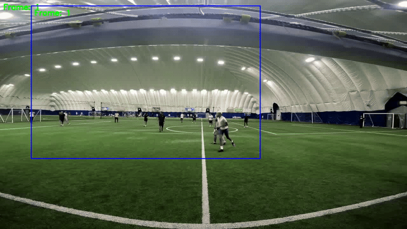
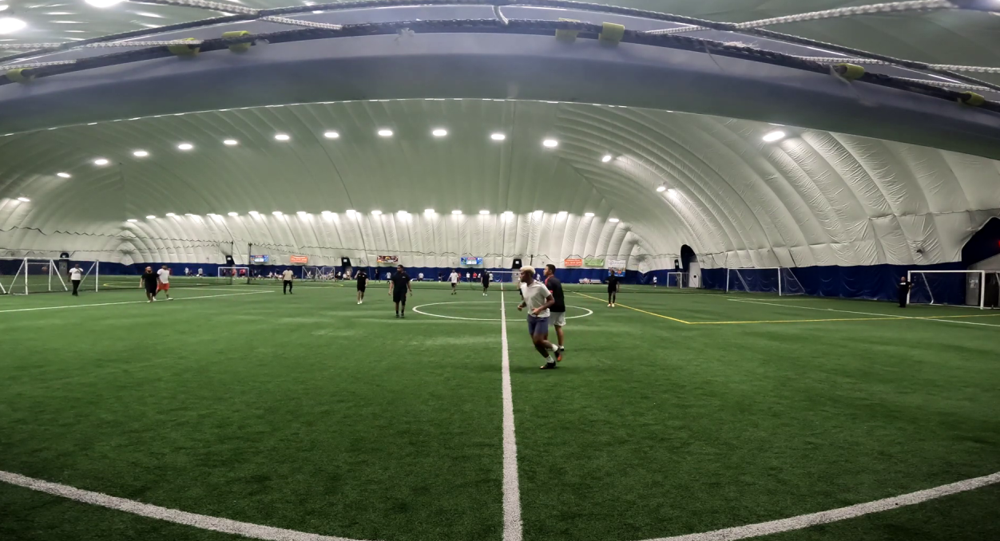
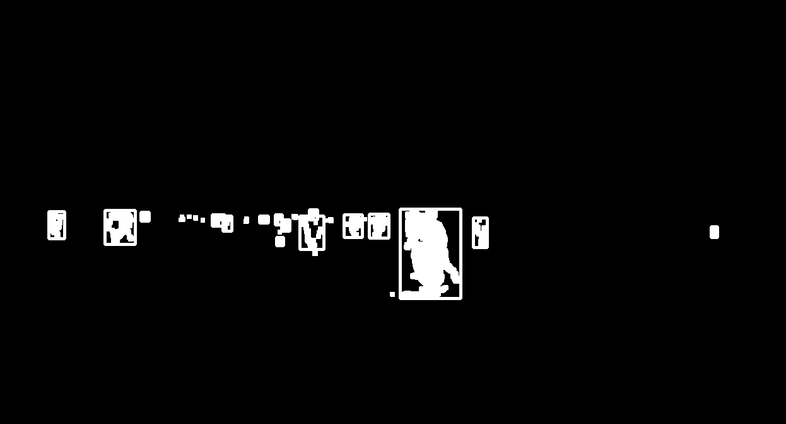
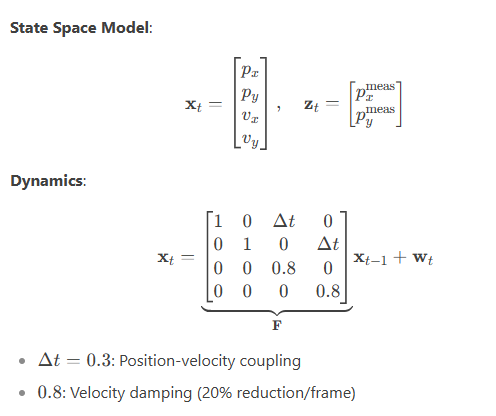

# Sports Motion Detection & Viewport Tracking

<p align="center">
  
  
</p>

## 📌 Introduction
This project implements an automated camera system for sports videos that:
 - Detects motion using frame differencing and contour analysis.
 - Tracks the main action with a smooth "virtual camera" viewport via hybrid Kalman Filter/EMA smoothing.
 - Generates outputs with visualized motion regions and stabilized viewports.
   
Built with Python and OpenCV, the system simulates professional broadcast camera work by intelligently following gameplay action while minimizing jerky movements.
## 🚀 Features
- ⚡ Frame-differencing motion detection
- 🎯 Adaptive EMA-Kalman hybrid tracking
- 🛠️ Configurable Target FPS & Viewport Size

## 🛠️ Installation
```bash
# Create conda environment
conda create -p venv_viewport python==3.10
conda activate venv_viewport/

# Install dependencies
pip install -r requirements.txt
```
## 💻 Usage
```bash
# Basic command with required arguments
python src/main.py --video "data\sample_video_clip.mp4" --output "output" --fps 5  --viewport_size "720x480"
```

## 🔍 Methodology
### 1.Video Preprocessing:
The **frame_processor.py** module handles video input, frame extraction at a target FPS, and resizing for consistency. This ensures downstream tasks (motion detection, viewport tracking) work with standardized frames.
- Sampled frames at a configurable FPS by calculating a dynamic frame_interval.  <br>
- Resized frames to 1280x720 using ***cv2.INTER_AREA*** (optimal for downscaling) interpolation to maintain aspect ratio.

### 2. Motion Detection:
The **motion_detector.py** module identifies regions of motion between consecutive frames using frame differencing and contour analysis. This serves as the foundation for viewport tracking.
- Preprocesses Frames: Converts to grayscale and applies Gaussian blur to suppress noise. This reduces computational 
  complexity while preserving motion information.
- Highlights Motion: Uses absolute frame differencing, binary thresholding and then dilation merges fragmented motion 
   regions for more coherent bounding boxes.
- Filters Contours: Retains only regions with $area > minarea$ to ignore minor artifacts.
- Returns Bounding Boxes: Coordinates of detected motion regions for viewport tracking $(x,y,w,h)$.

<p align="center">
  
  
</p>

### 3. Viewport Tracking
The **viewport_tracker.py** module implements an adaptive hybrid tracker that combines K-Means Clustering to identify primary motion regions, Kalman Filtering + EMA(Exponential Moving Average)for smooth viewport movement and Motion-Adaptive Blending to balance responsiveness and stability.

- Identifies ROI(Region of Interest): Uses K-Means clustering on motion boxes to select the dominant action region.
- Adaptive Smoothing: Blends Kalman Filter (for state prediction) and EMA (for responsiveness):
   - Here, First **Motion Analysis** is done by calculating **Motion Intensity** which is normalised sum of area of all detected bounding boxes in ROI. Then based on Motion Intensity value, weight is given to Kalman Filter and EMA respectively.
   - Low motion: 90% Kalman, 10% EMA (blend=0.1) for stability.
   - High motion: 70% Kalman, 30% EMA (blend=0.3) for agility.
- Boundary Handling: Clips viewport to frame edges to avoid invalid positions.

#### State Space Model used for Kalman Filter (Physics-Based Smoothing) is :

<p align="center">
  
</p>

where **w_t** is Process Noise and **F** is Transition Matrix .

### 4. Key Innovations & Solutions
1. **Adaptive Clustering for High-FPS Scenarios** :
   Challenge:
      - At high target FPS (>25), frame differencing generated sparse bounding boxes, causing standard K-Means (n_clusters=3) 
       to over-segment or fail.
